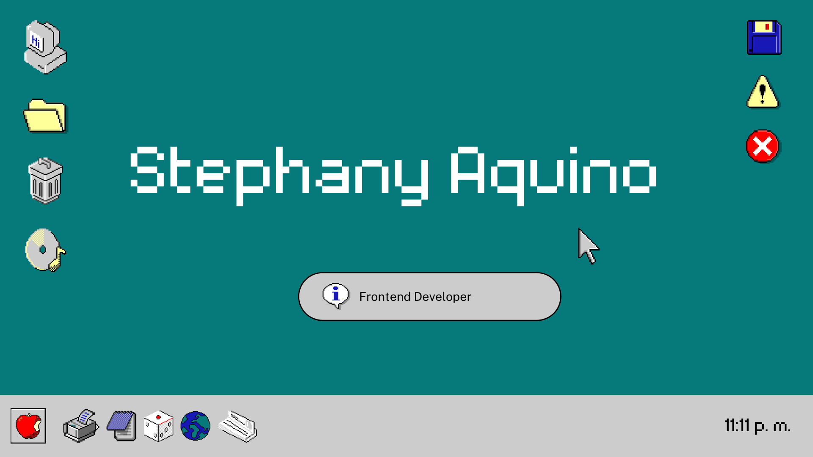

# 

  

## Bienvenidos a GitHub😊

 

soy una persona tranquila y reservada pero amable con mis amistades de confianza 

# Acerca de mi 😉

### Tecnologías de la información y la comunicación

### Contactame por Correo(phanyahdez@gmail.com)

# Proyectos 😎

### Hojas de cálculo, Mantenimiento y soporte de computo, Páginas Web, Diseño Digital

# Tecnologias💻

  

<!--
**Phany10073/Phany10073** is a ✨ _special_ ✨ repository because its `README.md` (this file) appears on your GitHub profile.

Here are some ideas to get you started:

- 🔭 I’m currently working on ...
- 🌱 I’m currently learning ...
- 👯 I’m looking to collaborate on ...
- 🤔 I’m looking for help with ...
- 💬 Ask me about ...
- 📫 How to reach me: ...
- 😄 Pronouns: ...
- ⚡ Fun fact: ...
-->
